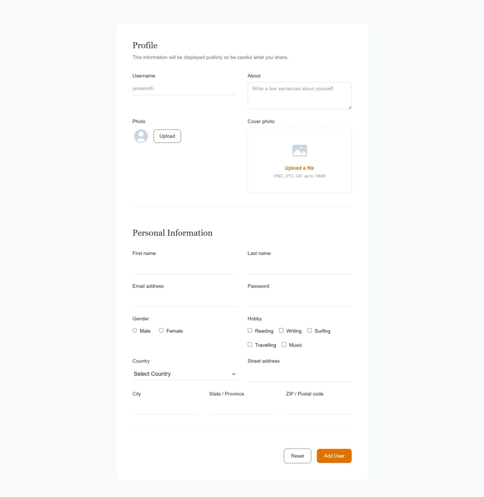
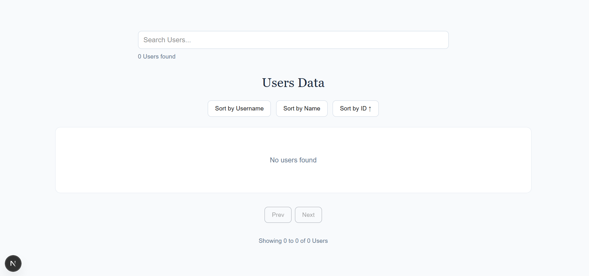
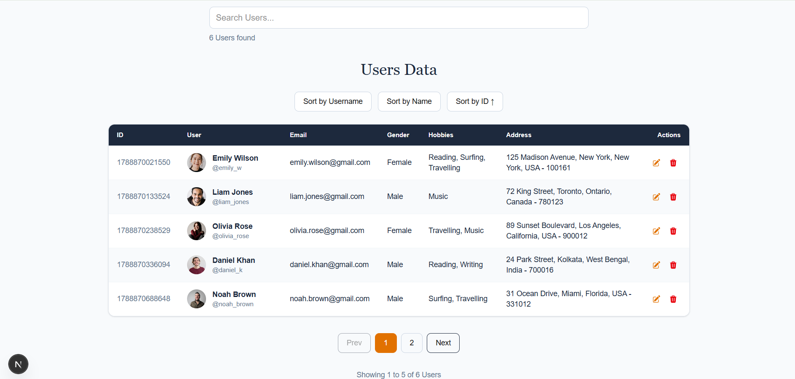

<div align="center">

# Project : User Management System

**A responsive and interactive User Management application built with Next.js, TypeScript, and Tailwind CSS. The application allows users to add, edit, delete, search, sort, and paginate user records while storing all data locally using the browser's Local Storage.**

</div>

---

## 📑 Table of Contents

* [Project Description](#-project-description)
* [How This Project is Made](#-how-this-project-is-made)
* [Features](#-features)
* [Technologies Used](#-technologies-used)
* [Installation](#-installation)
* [React & Next.js Concepts Covered](#-react--nextjs-concepts-covered)
* [How It Works](#-how-it-works)
* [Screenshot](#-screenshot)
* [Demo](#-demo)
* [Author](#-author)

---

## 📌 Project Description

The **User Management System** is a single-page user registration and management application built using **Next.js, TypeScript, and Tailwind CSS**.

The application provides a complete form for entering user information such as username, personal details, email, password, gender, hobbies, country, address, profile photo, and cover photo.

Submitted user data is stored in the browser's **Local Storage**, allowing the records to remain available even after refreshing the page.

The application also provides a user data table with **search, sorting, editing, deleting, and pagination** functionality, making it easy to manage multiple user records from a single page.

This project was created to practice React and Next.js concepts such as **useState, useEffect, controlled forms, event handling, array methods, TypeScript interfaces, Local Storage, validation, image handling, sorting, filtering, and pagination**.

---

## 🚀 How This Project is Made

This project is built using **Next.js**, **TypeScript**, **Tailwind CSS**, and **Heroicons** to create a responsive and interactive **User Management System**.

### 🧱 Form Structure

The application contains a detailed user registration form divided into different sections:

* **Profile**

  * Username
  * About
  * Profile Photo
  * Cover Photo

* **Personal Information**

  * First Name
  * Last Name
  * Email
  * Password
  * Gender
  * Hobbies
  * Country
  * Street Address
  * City
  * State
  * PIN / Postal Code

The form uses React state variables to control every input field.

### 🎨 Tailwind CSS Styling

* Tailwind CSS is used for the complete UI design.
* Responsive grid layouts are created using Tailwind's grid utilities.
* Utility classes are used for spacing, borders, typography, colors, buttons, and responsive layouts.
* The user form uses a clean white card layout with a slate-colored background.
* Amber is used as the primary action color.
* Responsive classes such as `sm:grid-cols-6`, `max-w-3xl`, and `max-w-6xl` provide responsive behavior.
* Hover and disabled states are implemented using Tailwind utility classes.

### ⚙️ React & Next.js Functionality

* `useState()` manages form fields, users, errors, search, sorting, pagination, and edit state.
* `useEffect()` loads previously stored users from Local Storage when the component mounts.
* Controlled inputs are used throughout the form.
* `localStorage` is used to save and retrieve user records.
* Array methods such as `filter()`, `map()`, `sort()`, and `slice()` are used for user management.
* `Date.now()` generates a unique numeric ID when a new user is added.
* TypeScript interfaces provide structure and type safety for user data.
* `window.confirm()` is used before deleting a user.
* `alert()` provides feedback after adding, updating, or deleting users.

---

## ✨ Features

* User Registration Form
* Controlled Form Inputs
* Form Validation
* Profile Photo Upload
* Cover Photo Upload
* Image Compression
* Local Storage Data Management
* Add User
* Edit User
* Delete User
* Search Users
* Sort Users
* Pagination
* Previous / Next Pagination Controls
* Dynamic User Count
* Responsive User Data Table
* Profile Image Preview
* Error Messages
* Reset Form
* TypeScript Type Safety
* Responsive Tailwind CSS Design
* Heroicons for Edit, Delete, Upload, and Profile Icons

---

## 🔧 Technologies Used

* Next.js
* React
* TypeScript
* Tailwind CSS
* JavaScript (ES6+)
* Heroicons
* HTML5
* Local Storage API

---

## 📥 Installation

### Create a Next.js Project

Create a new Next.js application using:

```bash
npx create-next-app@latest user-management
```

Move into the project folder:

```bash
cd user-management
```

### Install Heroicons

The project uses Heroicons for profile, upload, edit, and delete icons.

```bash
npm install @heroicons/react
```

### Start the Development Server

Run the following command:

```bash
npm run dev
```

The application will run on the local development server.

---

## 📚 React & Next.js Concepts Covered

* Functional Components
* Client Components
* `useState()`
* `useEffect()`
* Controlled Components
* Event Handling
* Form Handling
* Form Validation
* TypeScript Interfaces
* TypeScript Generics
* Array Methods

  * `map()`
  * `filter()`
  * `sort()`
  * `slice()`
  * `join()`
* Spread Operator
* Template Literals
* Conditional Rendering
* Local Storage
* File Handling
* `FileReader`
* Canvas API
* Image Compression
* Search / Filtering
* Sorting
* Pagination
* Responsive Design
* Tailwind CSS Utility Classes

---

## 🔄 How It Works

### 👤 Add User

The user fills out the registration form with their personal, contact, address, hobby, and profile information.

After successful validation:

1. A unique ID is generated using `Date.now()`.
2. A new user object is created.
3. The new user is added to the existing users array.
4. The updated array is saved to Local Storage.
5. The users table is updated.
6. The form is reset.
7. A success message is displayed.

### ✏️ Edit User

The **Edit** button allows an existing user's information to be loaded back into the form.

When editing:

1. The selected user's ID is stored in `editId`.
2. Existing user information is loaded into the form.
3. The user can modify the information.
4. After submission, the matching user is updated.
5. Updated data is saved to Local Storage.
6. The form is reset.

### 🗑️ Delete User

The **Delete** button removes a user from the table.

Before deleting, a confirmation dialog is displayed.

If the user confirms:

1. The selected record is removed using `filter()`.
2. The updated users array is saved to Local Storage.
3. The table is updated.
4. A success message is displayed.

### 🔍 Search Users

The **Search Users** field allows users to search through the stored user records.

The search checks the following fields:

* Username
* First Name
* Last Name
* Email
* Gender
* Country
* City
* State

The search is case-insensitive and uses JavaScript's `filter()` and `includes()` methods.

For example, searching for:

```text
sakina
```

can find a matching username, first name, or last name.

Searching for:

```text
india
```

can find users whose country is India.

### ↕️ Sort Users

Users can be sorted using:

* Sort by Username
* Sort by Name
* Sort by ID

Clicking the same sorting button again changes the sorting direction between:

```text
Ascending ↑
Descending ↓
```

The sorting uses JavaScript's `sort()` method.

### 📄 Pagination

The table displays **5 users per page**.

The application calculates the total number of pages based on the number of filtered and sorted users.

Pagination includes:

* Previous button
* Page numbers
* Next button
* Current page indication
* Showing X to Y of Z Users

The users are divided into pages using the `slice()` method.

### 🖼️ Image Upload & Compression

The application allows users to upload:

* Profile Photo
* Cover Photo

Before storing the image, it is processed using:

* `FileReader`
* `Image`
* HTML Canvas

The image is resized when necessary and converted into a compressed JPEG Base64 string.

This helps reduce the amount of data stored in Local Storage.

### 💾 Local Storage

User records are stored using the browser's Local Storage API.

Data is saved using:

```javascript
localStorage.setItem(
    "Users",
    JSON.stringify(updatedUsers)
);
```

When the page loads, the saved data is retrieved using:

```javascript
localStorage.getItem("Users");
```

The JSON data is then converted back into a JavaScript array using:

```javascript
JSON.parse(savedUserData);
```

### 🗂️ User Data Structure

Each user record contains:

```text
UserData
│
├── id
├── username
├── about
├── firstName
├── lastName
├── email
├── password
├── gender
├── hobby[]
├── country
├── streetAddress
├── city
├── state
├── pinCode
├── photo
└── coverPhoto
```

---

## 📸 Screenshot

### User Registration Form



### Users Data Table when no data is present



### Users Data Table when data is present



---

## 🎬 Demo

|                        |                                             |
| ---------------------- | ------------------------------------------- |
| 🔗 Live Demo           | **[User Management Website](https://user-management-system-website.netlify.app/)**     |
| 🎥 Project Walkthrough | **[Project Explanation](https://drive.google.com/file/d/1kORLoZ6Dk5Enxx5fMlRECVUHVFy-I-fW/view?usp=sharing)** |
| 🎥 Project Recording   | **[Project Demo](https://drive.google.com/file/d/10uOOJbKGGNuQQJiLFrW3bjweT7rOXhx3/view?usp=sharing)**        |

---

## 💻 Author

<div align="center">

**Sakina Mufaddal Sendhi**

[](https://github.com/sakinasendhi52)

⭐ Thank you for visiting this repository!

</div>
